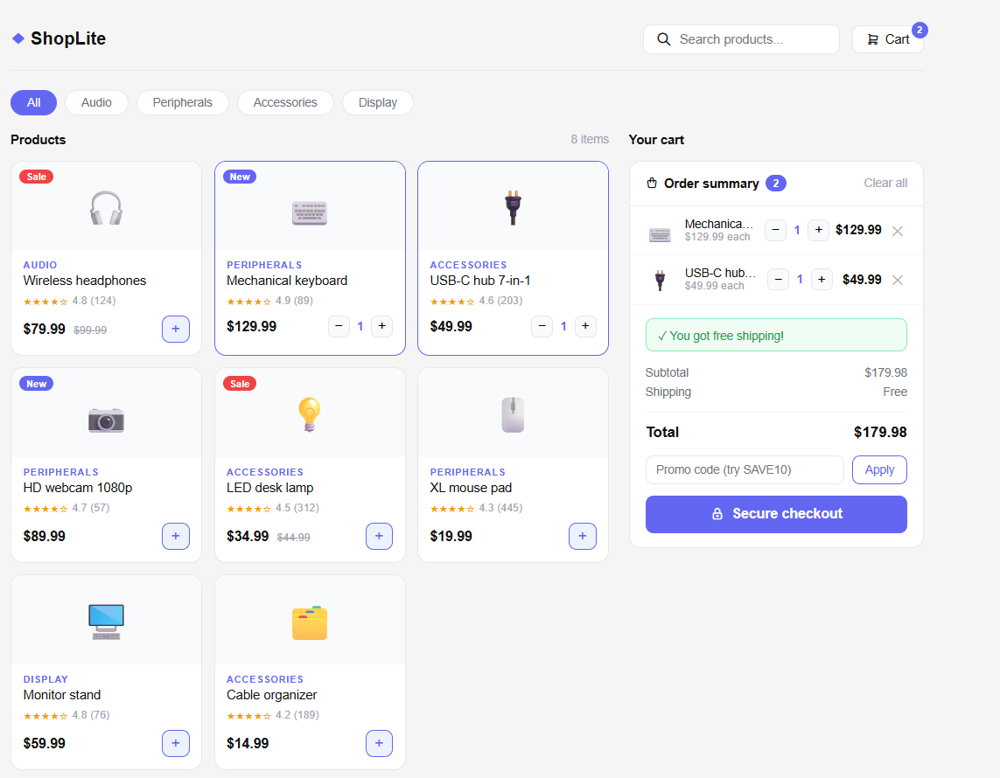

# 🛍️ ShopLite - Shopping Cart

A professional shopping cart web app built with pure HTML, CSS and JavaScript — no frameworks used.

## 🔗 Live Demo
[👉 Click here to view live](https://SuvvadaBhavana.github.io/shopping-cart)

## 📸 Screenshot

## ✨ Features

- 🔍 Real-time product search
- 🏷️ Filter products by category (Audio, Peripherals, Accessories, Display)
- ➕ Add / remove items from cart
- 🔢 Increase or decrease quantity
- 🎟️ Promo code support (try **SAVE10** for 10% off)
- 🚚 Free shipping on orders over $50
- 💰 Live subtotal, tax and total calculation
- 🔔 Toast notifications when adding to cart
- 📱 Responsive design for mobile and desktop
- 🏷️ Product badges (New / Sale)
- ⭐ Star ratings and review counts

## 🛠️ Built With

- HTML5
- CSS3
- JavaScript (Vanilla — no frameworks or libraries)
## 🚀 How to Run Locally

1. Clone the repository
2. Open the project folder in VS Code
3. Right click on `index.html`
4. Click **Open with Live Server**

## 📁 Project Structure
## 💡 What I Learned

- DOM manipulation with JavaScript
- Dynamic HTML rendering using template literals
- Managing application state with JavaScript objects and arrays
- Search and filter functionality
- CSS Grid and Flexbox for responsive layout
- Git and GitHub for version control
- Deploying a project with GitHub Pages

## 🧠 JavaScript Concepts Used

- `const` and `let` for variables
- Arrays and objects for data storage
- `find()` and `filter()` for searching
- `reduce()` for calculating totals
- Template literals for dynamic HTML
- `innerHTML` for updating the page
- Event listeners for user interactions
- Spread operator `...` for copying objects
- `delete` for removing cart items

## 👩‍💻 Author

**Suvvada Bhavana**
- GitHub: [@SuvvadaBhavana](https://github.com/SuvvadaBhavana)

## 📄 License

This project is open source and available under the [MIT License](LICENSE).
## 🚀 How to Run Locally

1. Clone the repository
